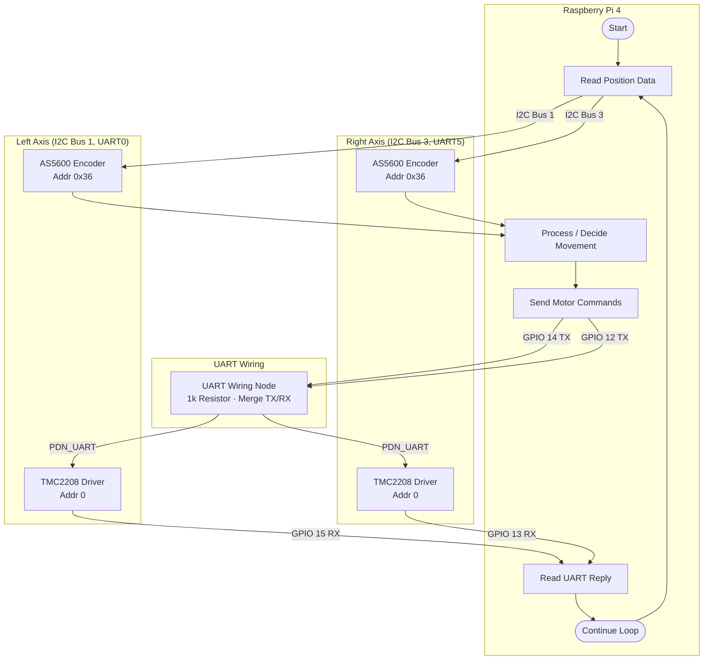
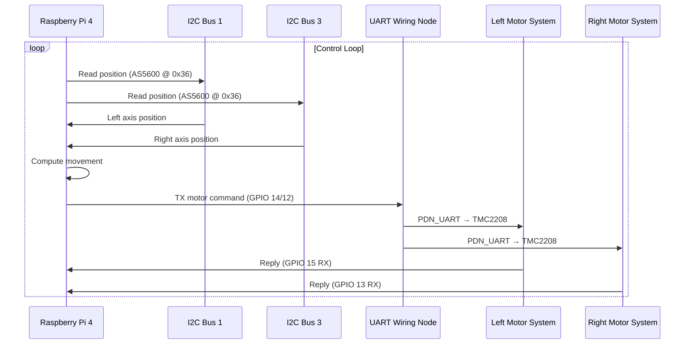
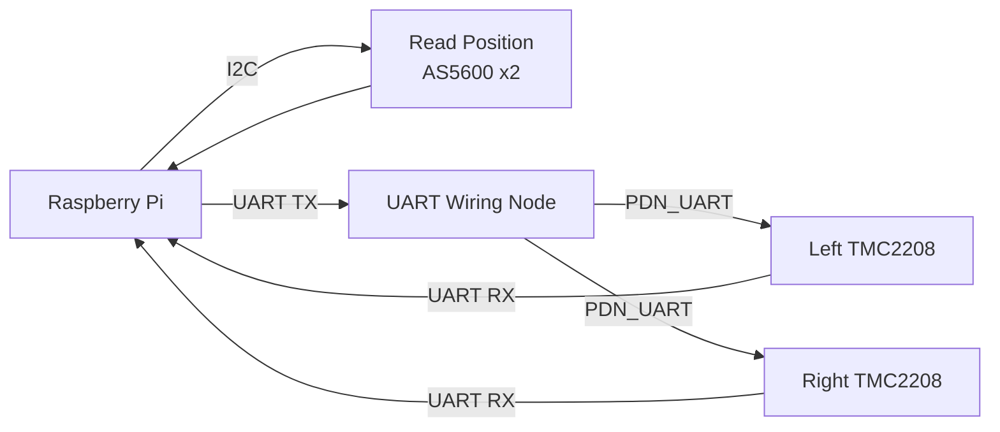

# Sorter MVP — Process Flow Diagram

Process flow derived from the hardware architecture in `Diagram.md.txt`.

## Data Flow Process

## Sequence Diagram (Communication Flow)

## Simplified Process Overview

